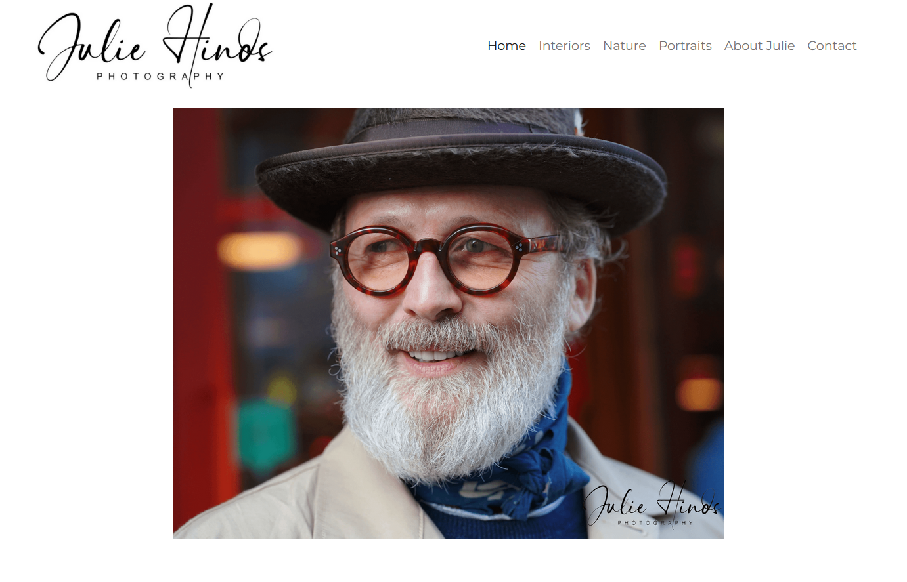

# Julie Hinos

The website is the display and portifolio of images and a point of easy contact with Julie Hinos, a freelancer photographer.

## Features

The website is a responsive website that is designed to be viewed on any device. Has a navigation bar that can be used to navigate through the website.
Moreover, the website has a contact form that can be used to contact Julie Hinos and send her a message and a portfolio of her work.
Each image on the portfolio is clickable and will open with the full size image.

### Existing Features

- **Navigation Bar**

  - The navigation bar is a list of links that can be used to navigate through the website. Home, Interiors, Nature, Portrait, About Julie and Contact.
  - Once the user clicks on a link, the page will scroll to the top of the page.
  - To return to the top of the page, the user can click on arrow up. Which will scroll the page to the top of the page.
  - 

- **The landing page image**

  - On the landing page, there is a carousel that will display images of Julie Hinos.
  - This carousel will change every 5 seconds.

- **Interior Nature and Portrait Sections**

  - These sections are the portfolio of images of Julie Hinos.
  - The user can click on an image to open the full size image.
  - Images were divided into three sections: Interior, Nature and Portrait to help the user navigate through the website.

- **About Julie Section**

  - The About Julie section is a short description of Julie Hinos.
  - The user can see the name, age, location, and a short description of her.

- **The Contact Page**

  - This page will allow the user to get in contact with Julie Hinos.
  - 

- **The Footer**

  - The footer is valuable to the user as it encourages them to keep connected via social media
  - The user can click on the icons to get to the social media pages.

### Features Left to Implement

    To be implemented:

    * Navegable gallery of images where the user click on one image and navigate on all the images from the same category.
    * Whatsapp live conversation with Julie Hinos.

## Testing

The website was tested on a desktop computer and a mobile phone.
Also, W3C and Jigsaw validation was used to validate the website HTML and CSS.
The major concerns were:

### Validator Testing

- HTML
  - No errors were returned when passing through the official [W3C validator](https://validator.w3.org/nu/?doc=https%3A%2F%2Fcode-institute-org.github.io%2Flove-running-2.0%2Findex.html)
- CSS
  - No errors were found when passing through the official [(Jigsaw) validator](https://jigsaw.w3.org/css-validator/validator?uri=https%3A%2F%2Fvalidator.w3.org%2Fnu%2F%3Fdoc%3Dhttps%253A%252F%252Fcode-institute-org.github.io%252Flove-running-2.0%252Findex.html&profile=css3svg&usermedium=all&warning=1&vextwarning=&lang=en#css)

### Unfixed Bugs

You will need to mention unfixed bugs and why they were not fixed. This section should include shortcomings of the frameworks or technologies used. Although time can be a big variable to consider, paucity of time and difficulty understanding implementation is not a valid reason to leave bugs unfixed.

## Deployment

This section should describe the process you went through to deploy the project to a hosting platform (e.g. GitHub)

- The site was deployed to GitHub pages. The steps to deploy are as follows:
  - In the GitHub repository, navigate to the Settings tab
  - From the source section drop-down menu, select the Master Branch
  - Once the master branch has been selected, the page will be automatically refreshed with a detailed ribbon display to indicate the successful deployment.

The live link can be found here - https://code-institute-org.github.io/love-running-2.0/index.html

## Credits

- Bootstrap examples for providing the styling and carousel for the website [Bootstrap](https://getbootstrap.com/)
- The icons in the footer were taken from [Font Awesome](https://fontawesome.com/)
- Pexels for providing all the images used in the website.[Pexels](https://www.pexels.com/)
