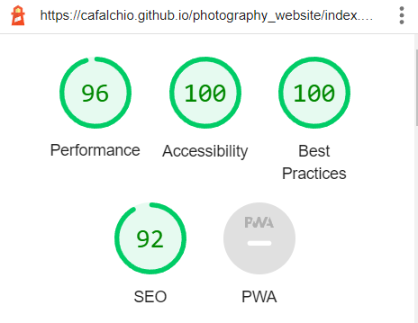

# Julie Hinos

The website is the display and portifolio of images and a point of easy contact with Julie Hinos, a freelancer photographer.

## Code institute MS1 Project Front End

## Features

The website is a responsive website that is designed to be viewed on any device. Has a navigation bar that can be used to navigate through the website.
Moreover, the website has a contact form that can be used to contact Julie Hinos and send her a message and a portfolio of her work.
Each image on the portfolio is clickable and will open with the full size image.

### Existing Features

- **Navigation Bar**

  - The navigation bar is a list of links that can be used to navigate through the website. Home, Interiors, Nature, Portrait, About Julie and Contact.
  - Once the user clicks on a link, the page will scroll to the top of the page.
  - To return to the top of the page, the user can click on arrow up. Which will scroll the page to the top of the page.
  - 

- **The landing page image**

  - On the landing page, there is a carousel that will display images of Julie Hinos.
  - This carousel will change every 5 seconds.

In Mobile:

- **Interior Nature and Portrait Sections**

  - These sections are the portfolio of images of Julie Hinos.
  - The user can click on an image to open the full size image.
  - Images were divided into three sections: Interior, Nature and Portrait to help the user navigate through the website.

- **About Julie Section**

  - The About Julie section is a short description of Julie Hinos.
  - The user can see the name, age, location, and a short description of her.

- **The Contact Page**

  - This page will allow the user to get in contact with Julie Hinos.
  - 

- **The Footer**

  - The footer is valuable to the user as it encourages them to keep connected via social media
  - The user can click on the icons to get to the social media pages.

### Features Left to Implement

- Navegable gallery of images where the user click on one image and navigate on all the images from the same category.
- Whatsapp live conversation with Julie Hinos.

## Testing

The website was tested on a desktop computer and a mobile phone.
Also, W3C and Jigsaw validation was used to validate the website HTML and CSS.

W3C Validation:

Jigsaw Validation:

Lighhouse mobile and desktop testing:

The major concerns were the speed to load the images. The images were reduced both in size and optimizila image compressor. The speed increased but it is still a concern in slow phone connection.

### Unfixed Bugs

The following bugs were not fixed:

The <\hr> tag was not working on the Nature section. I have tried to change the code, but I couldn't see the error. It works perfectly when I am using a local server, but not when I am using a live server.

## Deployment

- The website was deployed on a the Github Pages website.

The live link can be found here - https://cafalchio.github.io/photography_website/index.html

## Credits

- Bootstrap examples for providing the styling and carousel for the website [Bootstrap](https://getbootstrap.com/)
- The icons in the footer were taken from [Font Awesome](https://fontawesome.com/)
- Pexels for providing all the images used in the website.[Pexels](https://www.pexels.com/)
- Optmizila compressor to reduce the images sizes [Optmizila](https://optmizila.com/)
- The love running webpage, provided by Code Institute as an example
- Am I responsive for providing the responsive website [Am I Responsive](http://ami.responsivedesign.is/)
